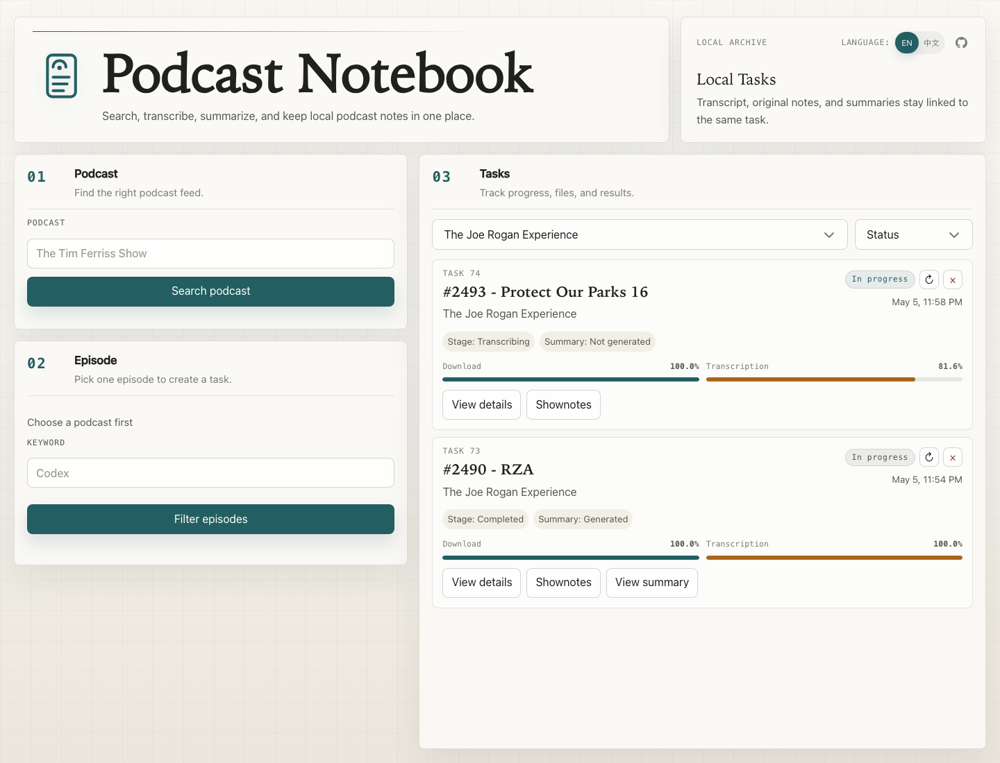

# Podcast Notebook

<p align="center">
  
</p>

Podcast Notebook is a local-first web app for turning podcast episodes into local transcripts, shownotes, and reusable summaries.

[中文版](README.zh-CN.md)

## Screenshots



## Why this exists

Podcast Notebook is built around common pain points for podcast listeners:

- You follow more podcasts than you can realistically listen to, and shownotes are often too thin to decide whether an episode is worth your time.
- Some episodes are dense enough to deserve notes, but manually listening, pausing, rewinding, and writing takes too long.

The app turns an episode into a searchable local transcript, cleaned shownotes, and a reusable summary so you can filter, prioritize, revisit, and write notes more efficiently.

It gives you a small local workspace for podcast research:

- find a podcast through Apple Podcasts / iTunes search
- choose a specific RSS episode
- download the episode audio locally
- transcribe it with `faster-whisper`
- keep task history, progress, events, and file paths in SQLite
- attach cleaned shownotes and generated Markdown summaries to the same task
- optionally generate Chinese or English summaries with an OpenAI-compatible LLM endpoint

It is designed for personal archives and research workflows, not as a hosted multi-user service.

## Workflow

```text
Search podcast -> Select episode -> Create task
      -> Download audio -> Transcribe locally -> Review transcript
      -> Generate summary -> Keep files linked to the task
```

The browser UI is organized around the same flow: podcast search, episode selection, and a task archive with download/transcription progress.

## Features

- Podcast search through the public iTunes Search API.
- RSS episode lookup with a six-hour in-memory cache.
- Audio download with progress tracking.
- Local CPU transcription through `faster-whisper`.
- Separate download and transcription progress.
- SQLite-backed task history and event logs.
- Duplicate protection by `podcast title + episode title`.
- Task delete and restart with cooperative cancellation.
- Local file archive for audio, transcripts, shownotes, and summaries.
- Chinese / English UI toggle.
- Optional Markdown summary generation through either an OpenAI-compatible API key or the project agent skill.

## Requirements

- Python 3.10+
- macOS or Linux
- Network access for podcast search, RSS fetching, audio downloads, model downloads, and optional LLM summary generation
- Enough disk space for downloaded audio, transcripts, and Whisper model files

The bootstrap script creates the project virtual environment and local runtime directories.

## Quick start

```bash
bash scripts/bootstrap_runtime.sh
```

If your default `python3` is older than 3.10, point the bootstrap script at a newer interpreter:

```bash
PYTHON_BIN=/opt/homebrew/bin/python3.12 bash scripts/bootstrap_runtime.sh
```

Run the app locally:

```bash
.venv/bin/uvicorn backend.app:create_app --factory --reload
```

Open:

```text
http://127.0.0.1:8000
```

The first transcription may take longer because the Whisper model has to be downloaded into `data/models/`.

## LAN access

To open the app from another device on the same network:

```bash
.venv/bin/uvicorn backend.app:create_app --factory --reload --host 0.0.0.0 --port 58049
```

Find your LAN IP on macOS:

```bash
ifconfig | grep "inet " | grep -v 127.0.0.1
```

Then open:

```text
http://<your-lan-ip>:58049
```

## Summary generation

Transcription is local. Summary generation is optional, and the project supports two paths.

### Option 1: in-app generation with an API key

The app can generate a summary through an OpenAI-compatible chat completions endpoint.

The recommended path is to store model settings in the private project config:

```bash
cp config/podcast_notebook.example.yaml config/podcast_notebook.yaml
```

Then edit `config/podcast_notebook.yaml`:

```yaml
llm:
  api_key: "..."
  base_url: "https://api.openai.com/v1"
  model: "gpt-4o-mini"
  timeout_seconds: 60
```

`config/podcast_notebook.yaml` is ignored by git, so it is suitable for local API keys.

If the API key is not configured, the app can still search, download, transcribe, and view existing files. New summary generation will fail with a configuration error.

### Option 2: agent-assisted generation with the project skill

You can also generate or revise summaries through an agent that uses the bundled project skill:

```text
skills/podcast-task-summarize/SKILL.md
```

The skill workflow can:

- locate the exact task in `data/db/podcast_notebook.db`
- read the cleaned shownotes and ASR transcript
- produce Chinese and English Markdown summaries under `data/summaries/`
- update `tasks.summarize` and `tasks.summarize_en`
- verify the app can read both summaries

## Subscription checks

To automatically discover episodes published in the last 3 days from podcasts you follow, maintain full podcast names in the private config:

```yaml
subscriptions:
  podcasts:
    - "The Daily"
    - "Acquired"
```

The checker searches each full podcast name and only accepts exact title matches. If no exact match is found, it skips that podcast and asks you to check the configured name.

The script creates tasks through the running local web app, so it behaves like clicking the create-task button in the frontend. The task enters the existing download/transcription flow, but the script does not wait for that work to finish.

Start the app first:

```bash
.venv/bin/uvicorn backend.app:create_app --factory --reload
```

Run one check manually:

```bash
.venv/bin/python scripts/check_subscriptions.py
```

The script can also be scheduled with crontab; see the automation scripts section below.

An episode is considered new when:

- its RSS publish date is within the last 3 local calendar days, including today
- no existing task has the same `podcast_title + episode_title`
- it has both a title and an audio URL

## Local data layout

Runtime files stay inside the repository and are ignored by git.

| Path | Purpose |
| --- | --- |
| `data/db/` | SQLite database |
| `data/downloads/` | Downloaded episode audio |
| `data/transcripts/` | Transcript `.txt` files |
| `data/shownotes/` | Cleaned episode shownotes |
| `data/summaries/` | Generated Markdown summaries |
| `data/models/` | Hugging Face / faster-whisper model cache |

## Development

Install runtime dependencies:

```bash
bash scripts/bootstrap_runtime.sh
```

Run tests:

```bash
.venv/bin/pytest -v
```

Run the maintenance helper:

```bash
.venv/bin/python scripts/maintain_tasks.py
```

The project includes two cron-friendly scripts:

- `scripts/check_subscriptions.py` checks configured podcast subscriptions and creates tasks for new episodes through the running local web app.
- `scripts/maintain_tasks.py` restarts stale tasks through the running local web app, so it behaves like clicking retry in the frontend; it does not wait for download or transcription to finish. It also deletes task audio after the generated summary has existed for more than 24 hours.

They can be scheduled with crontab. Replace `<schedule>` with the timing you want:

```cron
<schedule> cd /path/to/podcast_notebook && .venv/bin/python scripts/check_subscriptions.py >> /tmp/podcast_notebook_logs/check_subscriptions.log 2>&1
<schedule> cd /path/to/podcast_notebook && .venv/bin/python scripts/maintain_tasks.py >> /tmp/podcast_notebook_logs/maintain_tasks.log 2>&1
```

## Project map

```text
backend/
  app.py             FastAPI app and HTTP routes
  podcast_search.py  iTunes podcast search
  rss.py             RSS fetching and episode normalization
  downloads.py       Audio download helpers
  transcription.py   faster-whisper transcription
  summarizer.py      OpenAI-compatible summary generation
  tasks.py           Task lifecycle orchestration
  db.py              SQLite schema and persistence

frontend/
  index.html         Browser UI shell
  app.js             UI state, API calls, rendering, i18n
  styles.css         Application styling
  assets/            Logo and icon assets

scripts/
  bootstrap_runtime.sh
  check_subscriptions.py
  maintain_tasks.py

tests/
  pytest coverage for backend behavior, API routes, frontend copy, and task flow
```

## Troubleshooting

### The first transcription is slow

The model is downloaded on first use and cached under `data/models/`. CPU transcription can also be slow for long episodes.

### Podcast search returns no results

The app uses the public iTunes Search API. Check network access and try the exact podcast title.

### Episode search returns no results

Some RSS feeds do not expose audio enclosures or have unusual metadata. The app only lists entries with both a title and an audio URL.

### Summary generation fails

Check the `llm` section in `config/podcast_notebook.yaml`. Search, download, and transcription do not require summary settings.

### LAN access does not work

Start uvicorn with `--host 0.0.0.0`, use the machine's LAN IP, and check local firewall settings.

## License

MIT License. See [LICENSE](LICENSE).
