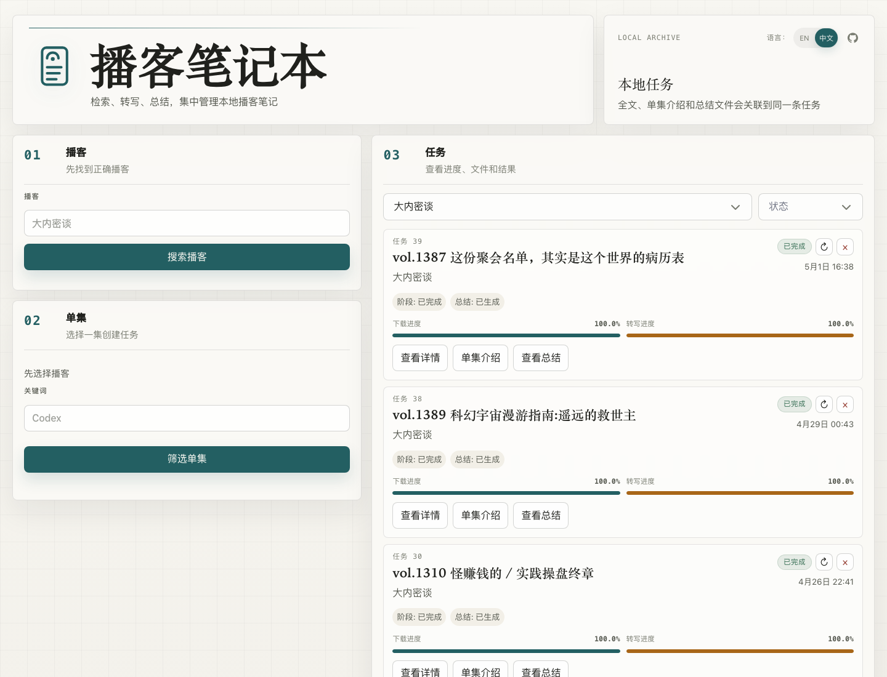

# Podcast Notebook / 播客笔记本

<p align="center">
  
</p>

播客笔记本是一个本地优先的 Web 应用，用来把播客单集变成本地全文稿、单集介绍和可复用的 Markdown 总结。

[English README](README.md)

## 截图



## 为什么需要它

播客笔记本主要解决播客收听者的常见痛点：

- 关注的播客很多，现实中听不完，而 shownotes 往往信息不足，无法判断某一期是否值得投入时间。
- 有些单集干货很多，很值得做笔记，但节目时间长，手动听、暂停、回退、记录的效率很低。

这个应用会把单集变成可搜索的本地全文稿、清理后的单集介绍和可复用总结，让你更高效地筛选、排序、回看和写笔记。

它提供一个小型本地播客研究工作台：

- 通过 Apple Podcasts / iTunes 搜索播客
- 从 RSS 中选择具体单集
- 把单集音频下载到本地
- 使用 `faster-whisper` 本地转写
- 用 SQLite 保存任务历史、进度、事件和文件路径
- 把清理后的单集介绍和生成的 Markdown 总结关联到同一条任务
- 可选使用 OpenAI-compatible LLM 接口生成中文或英文总结

它更适合个人资料库和研究流程，不是面向多用户的托管服务。

## 工作流

```text
搜索播客 -> 选择单集 -> 创建任务
      -> 下载音频 -> 本地转写 -> 查看全文稿
      -> 生成总结 -> 文件继续关联在任务上
```

浏览器界面也按这个流程组织：播客搜索、单集选择、任务归档，并展示下载和转写进度。

## 功能

- 通过公开 iTunes Search API 搜索播客。
- 读取 RSS 单集，并带有六小时内存缓存。
- 下载音频并追踪下载进度。
- 通过 `faster-whisper` 在本地 CPU 转写。
- 分开展示下载进度和转写进度。
- 用 SQLite 保存任务历史和事件日志。
- 按 `播客名 + 单集名` 防止重复任务。
- 支持删除和重新开始任务，运行中任务会先协作取消。
- 本地保存音频、全文稿、单集介绍和总结文件。
- 支持中文 / 英文界面切换。
- 可选通过 OpenAI-compatible API key 或项目 agent skill 生成 Markdown 总结。

## 环境要求

- Python 3.10+
- macOS 或 Linux
- 搜索播客、读取 RSS、下载音频、下载模型和可选 LLM 总结需要网络访问
- 需要足够磁盘空间保存音频、全文稿和 Whisper 模型文件

bootstrap 脚本会创建项目虚拟环境和本地运行目录。在 macOS 上，如果系统里有 `curl` 和 `unzip`，脚本也会尝试下载项目本地的 `tools/ffmpeg`。

## 快速开始

```bash
bash scripts/bootstrap_runtime.sh
```

如果默认 `python3` 低于 3.10，可以显式指定新版 Python：

```bash
PYTHON_BIN=/opt/homebrew/bin/python3.12 bash scripts/bootstrap_runtime.sh
```

本地启动应用：

```bash
.venv/bin/uvicorn backend.app:create_app --factory --reload
```

打开：

```text
http://127.0.0.1:8000
```

第一次转写可能会更慢，因为 Whisper 模型需要先下载到 `data/models/`。

## 局域网访问

如果想从同一网络里的另一台设备打开应用：

```bash
.venv/bin/uvicorn backend.app:create_app --factory --reload --host 0.0.0.0 --port 58049
```

在 macOS 上查看局域网 IP：

```bash
ifconfig | grep "inet " | grep -v 127.0.0.1
```

然后打开：

```text
http://<your-lan-ip>:58049
```

## 总结生成

转写是本地完成的。总结生成是可选功能，项目支持两种方式。

### 方式一：在应用内使用 API key 生成

应用可以通过 OpenAI-compatible chat completions 接口生成总结。

启动服务前设置这些环境变量：

```bash
export PODCAST_NOTEBOOK_LLM_API_KEY="..."
export PODCAST_NOTEBOOK_LLM_BASE_URL="https://api.openai.com/v1"
export PODCAST_NOTEBOOK_LLM_MODEL="gpt-4o-mini"
export PODCAST_NOTEBOOK_LLM_TIMEOUT="60"
```

只有 `PODCAST_NOTEBOOK_LLM_API_KEY` 是生成总结所必需的。其他值都有默认值。

如果没有配置 API key，应用仍然可以搜索、下载、转写和查看已有文件。只是新的总结生成会返回配置错误。

### 方式二：使用 agent + 项目 skill 生成

也可以让 agent 使用项目内置 skill 来生成或修改总结：

```text
skills/podcast-task-summarize/SKILL.md
```

该 skill 的工作流会：

- 在 `data/db/podcast_notebook.db` 中定位准确任务
- 读取清理后的单集介绍和 ASR 全文稿
- 在 `data/summaries/` 下生成中文和英文 Markdown 总结
- 更新 `tasks.summarize` 和 `tasks.summarize_en`
- 验证应用能读取两份总结

## 本地数据目录

运行时文件都保存在仓库内，并且会被 git 忽略。

| 路径 | 用途 |
| --- | --- |
| `data/db/` | SQLite 数据库 |
| `data/downloads/` | 下载的单集音频 |
| `data/transcripts/` | 全文稿 `.txt` 文件 |
| `data/shownotes/` | 清理后的单集介绍 |
| `data/summaries/` | 生成的 Markdown 总结 |
| `data/models/` | Hugging Face / faster-whisper 模型缓存 |
| `tools/ffmpeg` | 可选的项目本地 ffmpeg 二进制文件 |

## 开发

安装运行依赖：

```bash
bash scripts/bootstrap_runtime.sh
```

运行测试：

```bash
.venv/bin/pytest -v
```

运行维护脚本：

```bash
.venv/bin/python scripts/maintain_tasks.py
```

## 项目结构

```text
backend/
  app.py             FastAPI 应用和 HTTP 路由
  podcast_search.py  iTunes 播客搜索
  rss.py             RSS 获取和单集标准化
  downloads.py       音频下载工具
  transcription.py   faster-whisper 转写
  summarizer.py      OpenAI-compatible 总结生成
  tasks.py           任务生命周期编排
  db.py              SQLite schema 和持久化

frontend/
  index.html         浏览器 UI 外壳
  app.js             UI 状态、API 调用、渲染和 i18n
  styles.css         应用样式
  assets/            Logo 和图标资源

scripts/
  bootstrap_runtime.sh
  maintain_tasks.py

tests/
  覆盖后端行为、API 路由、前端文案和任务流程的 pytest 测试
```

## 常见问题

### 第一次转写很慢

第一次使用时会下载模型，并缓存到 `data/models/`。长播客在 CPU 上转写也会比较慢。

### 播客搜索没有结果

应用使用公开 iTunes Search API。先检查网络，再尝试输入准确的播客名称。

### 单集搜索没有结果

有些 RSS feed 不提供音频 enclosure，或者元数据结构不常见。应用只会列出同时有标题和音频 URL 的条目。

### 总结生成失败

检查 `PODCAST_NOTEBOOK_LLM_API_KEY`，以及自定义的 `PODCAST_NOTEBOOK_LLM_BASE_URL` / model 设置。搜索、下载和转写不依赖这些变量。

### 局域网访问失败

启动 uvicorn 时需要加 `--host 0.0.0.0`，访问时使用机器的局域网 IP，并检查本机防火墙设置。

## License

MIT License。详见 [LICENSE](LICENSE)。
